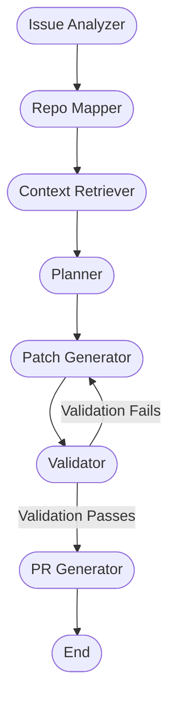

# Agentic Go Contributor

An Agentic AI system that autonomously resolves GitHub issues in open-source Go repositories. It performs the complete development cycle: understanding the issue, cloning the repository, searching for relevant code via AST parsing and semantic search, formulating an implementation plan, editing the code, running a repair loop via `go test`, and generating a Pull Request summary.

## Architecture



## How It Works

1. **Issue Analyzer**: Fetches the GitHub issue, reads comments, and extracts keywords.
2. **Repo Mapper**: Clones the repo (shallow copy) and builds an AST map of the entire codebase. This code map is stored in a **local vector store** for fast semantic search.
3. **Context Retriever**: Combines semantic embeddings and exact keyword matching to identify the top relevant `.go` and `_test.go` files.
4. **Planner**: Creates a step-by-step implementation plan.
5. **Patch Generator**: Replaces code blocks efficiently using a `<<<<<<< SEARCH ======= REPLACE >>>>>>>` diff strategy to avoid full file rewrites.
6. **Validator Loop**: Runs `go build`, `go test`, and `go vet` against the modified repository. If validation fails, stderr/stdout is fed back to the Coder agent to iteratively fix compilation or test errors (up to 3 retries).
7. **PR Generator**: Computes the final unified Git diff and generates an authoritative PR title and markdown body.

## Setup

1. **Clone the repository**
   ```bash
   git clone https://github.com/jigs1188/PRAgent.git
   cd PRAgent
   ```

2. **Install dependencies**
   Ensure Python 3.10+ is installed.
   ```bash
   pip install -r requirements.txt
   ```

3. **Set API Keys**
   Copy `.env.example` to `.env` and provide your credentials. The system supports multiple LLM providers, making it easy for evaluators to test using their preferred APIs (OpenAI, Gemini, or Anthropic/Claude).
   ```bash
   cp .env.example .env
   ```
   *Note: Ensure you set the relevant key (e.g., `OPENAI_API_KEY`, `GOOGLE_API_KEY`, or `ANTHROPIC_API_KEY`) depending on the provider you intend to use.*

## Usage

Run the agent by providing a target repository and an issue number.

```bash
python main.py --repo jigs1188/PRAgent --issue 2
```

To use a different LLM provider on the fly:
```bash
python main.py --repo gin-gonic/gin --issue 3804 --provider openai --model gpt-4o-mini
```

## Output

All agent artifacts are saved in the `output/issue-<number>/` directory, including:
- `agent_log.json`: The complete state history of the agent session.
- `plan.md`: The agent's generated implementation plan.
- `changes.diff`: A unified patch of all code modifications.
- `pr_title.txt`: The proposed Pull Request title.
- `pr_body.md`: The markdown description for the Pull Request.

## Requirements Checklist Status

This agent meets the requirements of the Agentic AI Contributor assignment:
- ✅ **Repository Inspection**: Clones repo, parses syntax trees, builds an embedded code map.
- ✅ **Issue Understanding**: Fetches issue title, body, and comments via GitHub API.
- ✅ **Context Retrieval**: Uses local vector store (embeddings) and grep to pull top semantic matches.
- ✅ **Code Modification**: Uses Search/Replace blocks (prevents full-file hallucination).
- ✅ **Validation Feedback Loop**: Runs native Go commands (`build`, `test`, `vet`) and feeds failures back to the LLM.
- ✅ **PR Generation**: Creates cleanly formatted patches, summaries, and PR descriptions.
- ✅ **Reliability**: Fully local vector store. Agent errors are caught gracefully. Retries handle transient rate-limits.
